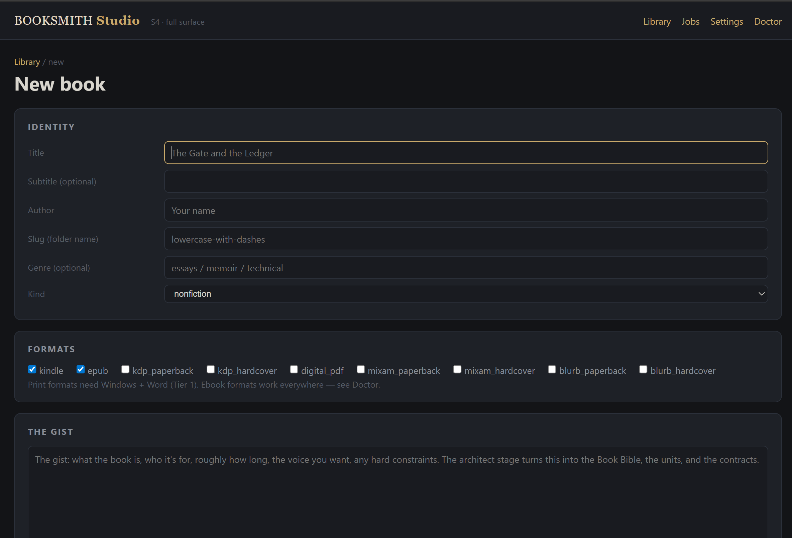

# BOOKSMITH

**A portable, one-shot vibe-book-writing kit.** Drop a gist of the book plus a folder of source documents into `intake/`, step away, and the harness autonomously architects the book, drafts a voice-consistent and continuity-checked manuscript, produces every upload-ready format, and generates and verifies the cover — surfacing a finished folder only once every mechanical and perceptual gate has passed.

This README is for a human. If you are the harness (Claude Code), your operating contract is `CLAUDE.md`; read that and `KIT_ARCHITECTURE.md` first.

---

## What you get

From one intake drop, BOOKSMITH produces nine upload-ready deliverables plus a cover:

- **Kindle** — reflowable DOCX for direct KDP upload + a 1600×2400 front-cover JPG (trim-matched 6:9).
- **EPUB 3** — standards-valid (with EPUB 2 compat) for Apple Books / Kobo / Google Play / Nook / Draft2Digital — and KDP's now-preferred reflowable upload.
- **KDP paperback** — interior DOCX + page-faithful PDF + a single `[back│spine│front]` cover wrap.
- **KDP hardcover** — the same interior + a hardcover wrap (case-board turn-in, board-added spine).
- **Mixam paperback** — ÷4-padded interior + a 0.125"-bleed wrap at Mixam geometry.
- **Mixam hardcover** — `inner_*.pdf` interior + three separate cover PDFs (`front_cover.pdf`, `back_cover.pdf`, `spine.pdf`).
- **Blurb trade paperback** and **Blurb ImageWrap hardcover** — interiors + wraps on Blurb's 6.125×9.25 page model (calculator-probed spine tables).
- **Digital PDF** — covers + a blank-stripped interior, for email/Drive (not for upload).

Each is checked against the production gates before the folder is surfaced — the mirror-margin flags, the empty-header fix, recto parity, spine math, cover legibility, ISBN keep-out, Kindle/print word-count parity.

---

## The Studio — drive it from a browser 🖥

A localhost web UI over the same deterministic engine, for when you would rather click than type
into a coding harness. Run `studio.cmd`; it prints a tokenized `http://127.0.0.1:8756/…` and opens it.



- **Library / Overview** — every workspace, the engine's stage rail (done · **stale** · failed ·
  awaiting model), a live run console, deliverables, and a spend meter.
- **Run** — run, resume, dry-run, run-to-stage, cancel (process-tree kill). The engine resumes from
  hash-keyed disk state, so a cancelled run costs only the stage it interrupted.
- **Revise** — write a direction for one chapter, see exactly which stages it re-opens, approve, and
  the engine re-drafts under the same gates. Every take is archived; nothing is overwritten.
- **Revision chat** — talk to the book in plain language. The model *compiles* intent into
  operations; it proposes, you approve. It cannot write prose, edit files, or delete anything.
- **Cover studio** — art provenance and reuse verdicts, re-roll, print wraps, and the perceptual
  gate: when no vision backend answers, you adjudicate PASS/FAIL yourself and the verdict is
  recorded against the image's hash.
- **Formats / QA** — `verify_build` rendered as a checks × formats grid with per-cell drill-down.
- **Settings / Doctor** — model backend, machine tier. **API keys live in the environment only**;
  the Studio never writes one to disk or echoes one back.

Optional install: `pip install -r requirements-studio.txt` (FastAPI + uvicorn — nothing else).
Design spec: [`docs/STUDIO_SPEC.md`](docs/STUDIO_SPEC.md) · build state + gate evidence:
[`docs/STUDIO_BUILD_LOG.md`](docs/STUDIO_BUILD_LOG.md).

The Studio holds no book state of its own: it *spawns* the engine and *projects* what the engine
writes. Every mutation — button or chat — goes through one typed operation catalog, under the same
gates, appended to the same ledgers.

## How to use it

### 1. Drop your intake

Put two things in `intake/`:

1. **A gist** — a short plain-language description of the book: what it is, who it's for, roughly how long, fiction or nonfiction, the register/voice you want, any hard constraints (a refrain that must appear verbatim, a title, an ending you'll write yourself).
2. **A folder of source documents** — anything the book draws on: research returns, character docs, prior fiction, voice samples, transcripts, raw logs. Duplicates and overlapping versions are fine; the harness reconciles them. Large files are fine; the harness sizes and chunks them.

You do not need to organize the folder or name files a particular way. The harness discovers and classifies what's there.

### 2. Boot the harness

*(Prefer a browser? Run `studio.cmd` instead — see [The Studio](#the-studio--drive-it-from-a-browser-) above. The rest of this section is the coding-harness path.)*

Open Claude Code in the BOOKSMITH folder and say, in plain language, what you want. (First time on this machine? Read `INSTALL.md` and run `python _tools/doctor.py` first.) The harness matches intent, not syntax:

- `init` — ingest and orient on the intake drop.
- `generate seed` — architect the book (Book Bible, contracts, registries, voice exemplars, config).
- `generate chapter 3` / `generate part 5` — draft one unit.
- `audit part 5`, `check seams`, `check refrain` — review and continuity.
- `produce format kdp_paperback` — build one format.
- `generate cover` — art + typography + perceptual verify.
- `export v1.0` — the final pass: fan out every format + cover, verify everything, emit the finished folder.

`export v1.0` pauses once to ask you to confirm ship-at-90%. That is the only interactive stop in the pipeline. Everything else runs to convergence.

### 3. Collect the finished folder

After `export v1.0`, the deliverables land under `book_workspace/<slug>/outputs/`, one subfolder per format, plus a per-format upload checklist and a dimension report. Upload to KDP and Mixam separately.

---

## The idea

Two commitments make BOOKSMITH work.

**A gate after every stage.** The pipeline is eight ordered stages (intake, ingest, seed, draft, seam, formats, cover, verify), and none advances on unverified state. Every failure this kit was built to prevent was an unverified-state-advanced-anyway failure: four rejected hardcover rounds on a prior book, a Kindle shipped 8,476 words short of its print edition, a paperback wrap uploaded to a hardcover listing, a "blank" page that rendered an inherited header and drew a rejection. Each gate is cheap and mechanical where a machine can check it, and perceptual (a vision model reads the rendered page or cover) only where a machine cannot see the defect.

**One authorial act.** The manuscript is written to read as if one person wrote the whole thing with continuous attention — residue carried across unit boundaries, callbacks that vary their source wording, motifs that recur in altered frames, register that varies by unit. A book that reads mass-produced fails, so this discipline is enforced as strictly as any dimension check.

Every hard-won production fix — the mirror-margin XML injection, the empty-header objects, the KDP hardcover turn-in, the Mixam filename router, the spine board-adds, Word COM as the only trustworthy DOCX→PDF path — ships as a *default* baked into the toolchain, so the first upload passes rather than being rediscovered per book.

---

## Requirements (see `INSTALL.md` for the walkthrough; `python _tools/doctor.py` checks your machine)

- **Python 3.10+** — `pip install -r requirements.txt` (the canonical dep list).
- **Node 18+** (any ≥14 works) — `docx` + `jszip` ship vendored in `_tools/node_modules`.
- **Tier 1 (full print pipeline): Windows + Microsoft Word.** Word COM is the only page-faithful DOCX→PDF path; Pandoc/LibreOffice/cloud converters break fonts, TOC hyperlinks, or pagination. **Without Word (Tier 2)** you still get EPUB, Kindle DOCX, cover compositing, and verification — print PDFs then need a Windows+Word box.
- **Optional — GPU for cover art**: RTX-class, ≥8 GB VRAM for SDXL base (~6.5 GB checkpoint, self-downloaded via `python _tools/fetch_weights.py sdxl`). No GPU? Put your own art in the book's `cover_art/` — typography compositing and verification run everywhere.
- **Optional — local vision**: a llama.cpp multimodal server for on-box, $0/token cover verification. The default (`--backend auto`) uses the harness's own vision — zero setup.

All machine paths live in `_tools/kit_env.json` (copy `kit_env.template.json` and fill for your box) — the one file that changes when the kit moves machines.

---

## Layout

```
BOOKSMITH\
├── CLAUDE.md              the orchestrator (the harness's operating contract)
├── README.md              this file
├── INSTALL.md             stranger onboarding: prerequisites, setup, first run
├── START_HERE.md          the first-session initialization prompt (paste into Claude Code)
├── KIT_ARCHITECTURE.md    the invariant design spec
├── requirements.txt       Python deps (pip install -r requirements.txt)
├── docs/
│   ├── LESSONS_LEDGER.md      the enforceable production-rules ledger
│   ├── vibe_writing_method.md the seed/contract/registry/handoff writing discipline
│   ├── format_spec_sheet.md   the exact-numbers cheat sheet (all formats)
│   ├── cover_pipeline.md      art-gen prompt rules + composite + perceptual verify
│   ├── COMPACTION_SURVIVAL.md session-survival: jsonl→md rehydration + hooks
│   └── VALIDATION.md          the loop-test proof record
├── studio/                the localhost web UI (server + projection + ops + chat; optional)
├── studio.cmd             launch the Studio
├── _tools/                the portable toolchain + schemas + kit_env.template.json
├── fonts/                 vendored OFL TTFs + per-family licenses (fonts/LICENSES/)
├── templates/             blank scaffolds the seed builder fills per book
├── intake/                DROP ZONE — your gist + source docs go here
└── book_workspace/<slug>/ created per book; testvoyage/ is the shipped example
```

## Per book

Each book gets its own workspace under `book_workspace/<slug>/` — its Book Bible (`seed.md`), config (`book_config.json`), contracts, registries, handoffs, versioned drafts, the untouched cover source art, and the `outputs/` deliverables. Drafts are append-only; the covers are always re-composited from the untouched AI source; and every generator reads one version-pinned manuscript, so no two formats can drift apart.

---

*BOOKSMITH is a machine for turning one intake drop into a finished, upload-ready book. The architecture is the invariant; a book is an instantiation. Ship at 90% — the canon is append-only.*
