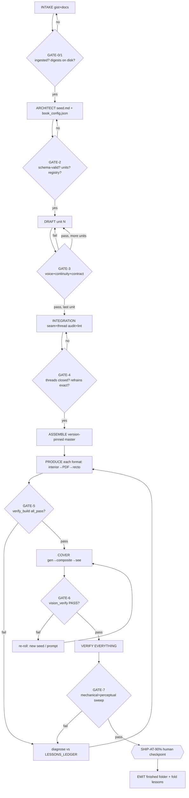
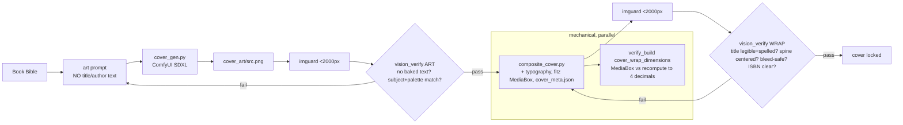

# BOOKSMITH — THE SUPERSTRUCTURE
### The wiring diagram, decision flowchart, and checklist‑of‑checklists that hold the whole book‑production frame so nothing can be forgotten.

*This is the root‑and‑branch map of the entire "vibe‑write a book" process — every stage, every gate, every tool, and (the point) every "cannot‑forget" bound to the mechanism that fails loudly if it is skipped. If you are a harness resuming or a fresh instance: this file + `CLAUDE.md` + `KIT_ARCHITECTURE.md` + `docs/LESSONS_LEDGER.md` are the four corners. Detail for any node lives in `LESSONS_LEDGER.md` (the 64 rules) and `format_spec_sheet.md` (the numbers). Companion picture: `BOOKSMITH_WIRING.svg`.*

**The governing principle — why there are no gaps.** Every requirement in this kit is bound to a **gate** that is either *mechanical* (`verify_build.py` — a deterministic check that returns pass/fail JSON) or *perceptual* (`vision_verify.py` — a vision model judging a rendered image against a rubric). A step is not "remembered by discipline"; it is *enforced by a check that fails if the step did not happen*. Forgetting to generate the cover art fails the vision gate (a blank gradient does not match the Book Bible). Forgetting recto starts fails `check_part_pages.py`. Forgetting mirror margins fails the `mirror_flags` check. **The anti‑forgetting matrix (§6) is the proof: every "million things" maps to an enforcer.**

---

## 1 · THE ROOT → BRANCH WIRING TREE

```
BOOKSMITH  (drop gist + docs → walk away → finished folder, 9 formats + cover)
│
├─ PHASE 0 · SESSION SPINE  ················· wraps every phase; survives compaction
│   ├─ Continuity ledger      _CONTINUITY.md (rewritten after every unit)      [pre‑compaction]
│   ├─ Rehydration hook       SessionStart(compact) → force re‑read of ledger  [post‑compaction]
│   ├─ Model policy           main = opus/fable ; subagents = sonnet | opus (NEVER fable for reads)
│   └─ Lessons capture        _LESSONS.md  → folds into docs/LESSONS_LEDGER.md
│
├─ PHASE 1 · INTAKE + INGEST  ·············· GATE‑0, GATE‑1
│   ├─ collect            intake/ gist + source docs (or named paths)
│   ├─ size               C:\chunker\estimate_tokens.py "FILE"     (route by size)
│   ├─ chunk / read       chunker.py (>40K tok) · Read pages (PDF) · never blind‑read >8K
│   ├─ reconcile          pick the authoritative version of each duplicated source
│   ├─ DIGEST FAN‑OUT     one subagent per satellite → canon_refs/_digest_*.md
│   │                     ⤷ PATTERN: write‑to‑disk‑THEN‑return  (survives quota/crash mid‑run)
│   └─ vendor             copy sources → book_workspace/<slug>/canon_refs/
│       GATE‑1 ▸ every source sized + ingested · digests on disk · no blind read
│
├─ PHASE 2 · ARCHITECT (SEED)  ············· GATE‑2   ← the creative act; prose is execution
│   ├─ read CORE fully    the central document, in windows if large
│   ├─ seed.md            Book Bible (Work Intent · THE FORM · Voice: 3 exemplars +
│   │                     blacklist + greenlist + sacred terms) · Structure (unit map) ·
│   │                     Thread Registry (refrains, callbacks, seed→payoff) · Exec Protocol
│   ├─ book_config.json   title/subtitle/author/slug · is_fiction · formats[] ·
│   │                     trim · paper · finish · interior{fonts,margins} · front_matter[] ·
│   │                     recto_strategy · units[]{id,title,class} · cover{title_face,palette,
│   │                     art{checkpoint,workflow,prompt_seed,negative}} · spine{constants} ·
│   │                     kdp_metadata{description,categories,keywords,bisac,price,isbn} ·
│   │                     authorship{classes} · voice{unit_noun,blacklist,greenlist,sacred_terms}
│   ├─ validate           jsonschema  ← book_config.schema.json          [GATE‑2 mechanical]
│   └─ stubs              init_contracts.py → contracts/<unit>.md
│       GATE‑2 ▸ seed §1–§7 present · config schema‑valid · units enumerated · registry seeded
│
├─ PHASE 3 · DRAFT  ······················ GATE‑3, looped per unit
│   ├─ order              sequential 1→N when interconnected (folds/mirrors demand it)
│   ├─ Context Pack       Book Bible + this contract + adjacent contracts +
│   │                     PRIOR UNIT **FULL PROSE** (not the handoff) + registries + digest
│   ├─ authorship gate    A = outline only (human writes) · B = scaffold + [BO‑WRITES] ·
│   │                     C = full draft   — NEVER silent‑upgrade a Class A
│   ├─ write              manuscript/current/ch_NN_current.md · H1 = units[].title exactly
│   ├─ self‑check         voice(blacklist=0, exemplar‑match) · continuity(threads/callbacks) ·
│   │                     contract(must‑accomplish, ±20% words)
│   └─ UPDATE LEDGER      _CONTINUITY.md ← after every unit (Phase 0)
│       GATE‑3 ▸ voice + continuity + contract pass · bounded 3‑iter fix loop
│
├─ PHASE 4 · INTEGRATION  ················ GATE‑4
│   ├─ seam pass          read each boundary (last 500 + first 500 words); heal tone
│   ├─ thread audit       every seed→payoff closed · refrains at EXACT count ·
│   │                     mirror/echo sentences at EXACT count · sacred terms consistent
│   └─ lint               lint_manuscript.py (PDF‑round‑trip corruption + blacklist)
│       GATE‑4 ▸ no orphan threads · refrains exact · reads as ONE authorial act
│
├─ PHASE 5 · ASSEMBLE  ··················· the anti‑drift KEYSTONE
│   └─ assemble_manuscript.py → outputs/markdown/<slug>_vN.md   (the ONE master all generators read)
│       ▸ word count = parity baseline (the fix for the 8,476‑words‑short Kindle bug)
│
├─ PHASE 6 · PRODUCE FORMATS  ············ GATE‑5, per format (9 branches)
│   ├─ INTERIOR (Node docx@9.6.1 + jszip)
│   │   ├─ generate_book.js --format {kdp_paperback|kdp_hardcover|mixam_hardcover|
│   │   │                              mixam_paperback|blurb_paperback|blurb_hardcover}
│   │   │     ├─ RECTO: per‑chapter SectionType.ODD_PAGE + trailing EVEN_PAGE blank  ★right‑side★
│   │   │     ├─ emptyHeadersFooters() on EVERY header‑free section  (margin=0 is the WRONG fix)
│   │   │     ├─ inject_mirror_margins.js  → <w:mirrorMargins/> + <w:evenAndOddHeaders/>
│   │   │     ├─ inject_front_matter_valign.js → <w:vAlign> per ceremonial section
│   │   │     └─ latex_to_unicode.js (only if math; Cambria Math; subscripts‑before‑fractions)
│   │   ├─ generate_kindle.js   (reflowable; H1 auto‑TOC; no print concepts)
│   │   └─ build_epub.py        (EPUB 3 + NCX; cover embedded; KDP‑preferred Kindle path)
│   ├─ PDF + PAGES (Python · Word COM)
│   │   ├─ docx_to_pdf.py <docx> <pdf> [--pad-multiple 4 for Mixam]
│   │   │     ▸ update fields BY INDEX (TOC .Update() invalidates handles → crash) · FileFormat=17
│   │   └─ check_part_pages.py  → recto parity (structural: outline‑level‑1 paragraphs)
│   ├─ DIGITAL  build_digital_pdf.py (front+back cover + blank‑stripped interior) · strip_blank_pages.py
│   └─ MECHANICAL GATE  verify_build.py --format X  → all_pass:true required
│         checks: mirror_flags · empty_headers · recto_parity · page_multiple(÷2 KDP/Blurb, ÷4 Mixam) ·
│                 pages_match_compositor · cover_wrap_dimensions(4‑dec) · lint · kindle/epub parity
│       GATE‑5 ▸ every produced format's mechanical checks green
│
├─ PHASE 7 · COVER — generate → composite → SEE → verify  ···· GATE‑6  ★text‑to‑image★
│   ├─ checkpoint         present in ComfyUI/models/checkpoints? else fetch (fetcher / comfy model download)
│   ├─ VRAM               free enough? (SDXL ~7–8GB) — else stop KEEL vision on :8080 first
│   ├─ server             ComfyUI up on :8188? else launch (venv python main.py --lowvram --cpu-vae)
│   ├─ ART PROMPT         built from Book Bible (mood/palette/motifs) — RULE: no title/author text in art
│   ├─ GENERATE           cover_gen.py → SDXL PNG → cover_art/<slug>_src.png   ★must actually run★
│   │                     ▸ strip non‑node keys (_comment) from the workflow graph before /prompt
│   ├─ COMPOSITE          composite_cover.py --profile {kdp-wrap|kdp-hardcover|mixam-3panel|
│   │                     kindle|blurb-wrap|blurb-imagewrap} --pages N
│   │                     ▸ PAGES re‑derived from the interior PDF (never hard‑coded) ·
│   │                       fitz EXACT MediaBox (not PIL) · cover_meta.json sidecar written ·
│   │                       Mixam filenames inner_/front_cover/back_cover/spine (never bare back.pdf)
│   ├─ SEE                imguard.py resize <2000px → render/view the image
│   └─ PERCEPTUAL GATE    vision_verify.py --backend keel|claude
│         art rubric: no baked text · subject+palette match Bible · focal room for title
│         wrap rubric: title/author legible+spelled · tracking clean · spine centered ·
│                      bleed‑safe · ISBN keep‑out clear
│       GATE‑6 ▸ perceptual PASS on the art AND every composited cover · bounded re‑roll on FAIL
│
├─ PHASE 8 · VERIFY EVERYTHING  ·········· GATE‑7
│   └─ verify_build.py green ∀ format · vision_verify green ∀ cover · rendered‑page spot checks
│       GATE‑7 ▸ full mechanical + perceptual sweep green
│
└─ PHASE 9 · EMIT / SHIP
    ├─ outputs/  markdown · kindle(docx+jpg) · epub · kdp_paperback · kdp_hardcover ·
    │            mixam_hardcover · mixam_paperback · blurb_paperback · blurb_hardcover · digital
    ├─ per‑format upload checklist + dimension report
    ├─ kdp_metadata ready (description ≤4000 · 3 categories · 7 keywords · price · ISBN policy)
    ├─ SHIP‑AT‑90% gate   ← the one sanctioned human checkpoint
    └─ FOLD LESSONS       _LESSONS.md → docs/LESSONS_LEDGER.md  (continuous improvement loop)
```

---

## 2 · THE PIPELINE FLOW (gated; nothing advances on unverified state)



---

## 3 · THE DECISION TREE (the branch points a book takes)

```mermaid
flowchart TD
    F{is_fiction?} -- yes --> FD[fiction copyright disclaimer]
    F -- no --> NF[math? → latex_to_unicode path]
    FMT{which formats in formats[]?} --> K[kindle] & E[epub] & KP[kdp_paperback] & KH[kdp_hardcover] & MH[mixam_hardcover] & MP[mixam_paperback] & BP[blurb_paperback] & BH[blurb_hardcover] & DG[digital_pdf]
    PP{paper cream/white?} -- cream --> PC[spine ×0.0025]
    PP -- white --> PW[spine ×0.002252]
    KH -.forces white.-> PW
    ART{cover art present in cover_art/?} -- yes, author-supplied --> COMP[composite only]
    ART -- no, generate --> VR{VRAM free ≥8GB?}
    VR -- no --> STOP[stop KEEL vision :8080] --> CK
    VR -- yes --> CK{checkpoint present?}
    CK -- no --> FE[fetch SDXL] --> LC
    CK -- yes --> LC{ComfyUI up :8188?}
    LC -- no --> LNCH[launch main.py --lowvram] --> GEN
    LC -- yes --> GEN[cover_gen.py]
    GEN --> COMP
    VB{vision backend: KEEL up :8080?} -- yes --> KEEL[--backend keel]
    VB -- no --> CLA[--backend claude via imguard]
    AC{authorship class of unit?} -- A --> OUT1[outline only]
    AC -- B --> SCAF[scaffold + BO-WRITES]
    AC -- C --> DR[full draft]
    MIN{pages < service min?} -- yes --> NOTE[informational note; proceed]
    SPN{spine < 0.25in?} -- yes --> BLANK[blank spine]
    RES{verify FAIL?} -- yes --> DIAG2[diagnose vs LESSONS_LEDGER → bounded retry → hard-stop escalate]
```

---

## 4 · THE COVER LOOP + TWO‑VERIFIER MODEL (the "cannot forget the image" engine)



*One eye does both jobs — the same vision faculty generates‑then‑verifies the cover and proofs the interior. Mechanical checks handle everything countable; perceptual checks handle everything a number cannot see.*

---

## 5 · THE COMPACTION SPINE (Phase 0 — the frame that survives context loss)


---

## 6 · THE ANTI‑FORGETTING MATRIX  (every "million things" → its enforcer; this is the no‑gaps proof)

| # | The thing that must not be forgotten | Phase | Tool that does it | Gate that FAILS if skipped | Symptom of the miss |
|---|---|---|---|---|---|
| 1 | **Generate the cover ART (text‑to‑image), not a placeholder** | 7 | `cover_gen.py` (ComfyUI SDXL) | `vision_verify` art rubric | blank/gradient fails "subject matches Bible" |
| 2 | **Chapters start on the RIGHT (recto) page for print** | 6 | per‑chapter `ODD_PAGE` + trailing `EVEN_PAGE` | `check_part_pages.py` / `recto_parity` | heading lands on verso → FAIL |
| 3 | Mirror margins present (gutter on correct side) | 6 | `inject_mirror_margins.js` | `mirror_flags_in_settings` | KDP "insufficient gutter" |
| 4 | Empty Header/Footer on every blank/front‑matter section | 6 | `emptyHeadersFooters()` | `empty_headers_on_headerfree_sections` | KDP "text outside margins" |
| 5 | Front‑matter vertical centering | 6 | `inject_front_matter_valign.js` | (visual spot‑check) | half‑title/copyright mis‑placed |
| 6 | Mixam interior page count ÷4 | 6 | `docx_to_pdf.py --pad-multiple 4` | `page_count_multiple` | Mixam upload reject |
| 7 | KDP/Blurb page count ÷2 | 6 | trailing EVEN_PAGE blank | `page_count_multiple` | odd total reject |
| 8 | Spine width correct per format/paper | 7 | `composite_cover.py` spine math + `spine_override_in` | `cover_wrap_dimensions` (4‑dec) | wrong wrap → dimension reject |
| 9 | PAGES re‑derived (never hard‑coded across compositors) | 6→7 | single injected `--pages N` from the PDF | `pages_match_compositor` | stale cover for wrong page count |
| 10 | Exact‑inch cover MediaBox (fitz, not PIL) | 7 | `composite_cover.py` (PyMuPDF) | `cover_wrap_dimensions` | KDP 4‑decimal reject |
| 11 | KDP hardcover uses turn‑in 0.708 + white spine + 10.417 h | 7 | `kdp-hardcover` profile | `cover_wrap_dimensions` | paperback‑bleed wrap on HC listing |
| 12 | Mixam covers as 3 panels, filename‑routed | 7 | `mixam-3panel` (`front_cover`/`back_cover`/`spine`) | (naming + dims) | bare `back.pdf` → body page 1 |
| 13 | No title/author text baked in the AI art | 7 | prompt rule + negative prompt | `vision_verify` OCR | text collides with composited title |
| 14 | Word‑count parity: ebook not below print | 6 | one version‑pinned master (`assemble_manuscript`) | `kindle/epub parity` | Kindle 8,476 words short |
| 15 | Fonts vendored repo‑relative (no C:\Claude‑Titanic\fonts) | 2/7 | `fonts/` + `fonts/library/` | compositor font‑exists check | missing‑font crash |
| 16 | Math survives to Kindle | 6 | `latex_to_unicode.js` + Cambria Math tag | (lint / visual) | broken glyphs on Kindle |
| 17 | No PDF‑round‑trip corruption / banned vocab | 4/6 | `lint_manuscript.py` | `lint_manuscript_clean` | `a_Thursday`, blacklist leak |
| 18 | Word‑COM field update won't crash | 6 | update fields BY INDEX in try/except | (docx_to_pdf runs clean) | COM crash on TOC update |
| 19 | ISBN barcode keep‑out clear (KDP overlays its own) | 7 | `composite_cover.py` isbn_keepout | `vision_verify` wrap rubric | barcode over back‑cover text |
| 20 | Invoke tools via PowerShell, not Bash (Windows) | all | PowerShell | (runtime) | `C:\x\y.py` → `xy.py` path‑eat |
| 21 | Digest agents write‑to‑disk THEN return | 1 | subagent contract | (files present in canon_refs/) | quota death loses all work |
| 22 | EPUB mimetype first + STORED, XML well‑formed | 6 | `build_epub.py` | `epub_structure` | reader rejects the epub |
| 23 | Amazon compilation‑detector: don't nest same‑named docs | 2/9 | series split; "Book 1" out of subtitle | (metadata review) | KDP copyright reject |
| 24 | Subagents = sonnet or opus, never Fable | all | Agent/Workflow `model:` | (policy) | wrong‑tier reads |
| 25 | Continuity survives compaction | 0 | `_CONTINUITY.md` + hooks | SessionStart(compact) inject | resume from summary → drift |
| 26 | **Kit stays internally coherent / giftable** (clone runs cold) | all | `selfcheck.py` | `selfcheck` meta-gate (nonzero exit on FAIL) | py won't compile / dead script ref / schema drift / missing font in a fresh clone |

*(The full 64 rules with exact params live in `docs/LESSONS_LEDGER.md`; the exact numbers per service in `docs/format_spec_sheet.md`; service geometry in `_tools/print_presets.json`.)*

---

## 7 · THE CHECKLIST OF CHECKLISTS

### ☐ CHECKLIST 0 — Session spine (verify at start of every working session)
- [ ] `_CONTINUITY.md` read (if resuming) and being rewritten after each unit
- [ ] model policy honored: main opus/fable; **subagents sonnet|opus, never Fable**
- [ ] `_LESSONS.md` open for observations to fold back later
- [ ] rehydration hook present (SessionStart compact) OR manual re‑read discipline active

### ☐ CHECKLIST 1 — Intake & ingest
- [ ] every source sized (`estimate_tokens.py`); >40K chunked; PDFs read by page
- [ ] duplicate versions reconciled to one authoritative each
- [ ] one digest per satellite written to `canon_refs/_digest_*.md` (write‑then‑return)
- [ ] sources vendored into `book_workspace/<slug>/canon_refs/`
- [ ] no blind read of any file >8K tokens

### ☐ CHECKLIST 2 — Architect (seed)
- [ ] CORE document read in full
- [ ] `seed.md`: Work Intent · THE FORM · Voice (3 exemplars + blacklist + greenlist + sacred terms) · unit map · thread registry (refrains/mirror‑sentences/seed→payoff) · exec protocol
- [ ] `book_config.json`: all 17+ fields; formats[] chosen; units[] with id+title+class
- [ ] config validates against `book_config.schema.json`
- [ ] `init_contracts.py` run → per‑unit stubs

### ☐ CHECKLIST 3 — Draft (per unit, ×N)
- [ ] Context Pack loaded incl. **prior unit full prose** + relevant digest
- [ ] authorship class respected (A outline / B scaffold / C draft; A never silent‑upgraded)
- [ ] H1 = `units[].title` exactly; written to `manuscript/current/ch_NN_current.md`
- [ ] self‑check: blacklist=0, exemplar‑consistent, threads placed, ±20% words
- [ ] **`_CONTINUITY.md` updated** with this unit + live invariant counts

### ☐ CHECKLIST 4 — Integration
- [ ] seam pass over every boundary
- [ ] every seed→payoff closed; every refrain at its exact count; every mirror/echo sentence at its exact count
- [ ] sacred terms consistent; `lint_manuscript.py` exit 0

### ☐ CHECKLIST 5 — Assemble
- [ ] `assemble_manuscript.py` → `outputs/markdown/<slug>_vN.md`; word count recorded as parity baseline

### ☐ CHECKLIST 6 — Produce formats (per format in formats[])
- [ ] interior generated (`generate_book.js` / `generate_kindle.js` / `build_epub.py`)
- [ ] recto ODD_PAGE + trailing EVEN_PAGE; empty headers; mirror + vAlign injected
- [ ] PDF via `docx_to_pdf.py` (fields‑by‑index; `--pad-multiple 4` for Mixam); page count captured
- [ ] `check_part_pages.py` recto parity PASS
- [ ] `verify_build.py --format X` → **all_pass:true**
- [ ] digital: `build_digital_pdf.py` (+ `strip_blank_pages.py`)

### ☐ CHECKLIST 7 — Cover (generate → composite → see → verify)
- [ ] checkpoint present (else fetch); VRAM free (else stop KEEL vision); ComfyUI up (else launch)
- [ ] **`cover_gen.py` actually run** → real art PNG (no baked text)
- [ ] `composite_cover.py --profile … --pages N` for every print profile + kindle front; `cover_meta.json` written
- [ ] imguard resize → **`vision_verify.py`** PASS on art AND every composited wrap
- [ ] bounded re‑roll on any FAIL

### ☐ CHECKLIST 8 — Verify everything
- [ ] `verify_build.py` green for every format
- [ ] `vision_verify.py` green for every cover
- [ ] rendered‑page spot checks (render → imguard → vision) clean

### ☐ CHECKLIST 9 — Emit / ship
- [ ] every format's deliverables present in `outputs/`
- [ ] per‑format upload checklist + dimension report written
- [ ] `kdp_metadata` ready (description ≤4000 · ≤3 categories · ≤7 keywords · price · ISBN policy; "Book 1" out of subtitle)
- [ ] SHIP‑AT‑90% human checkpoint confirmed
- [ ] `_LESSONS.md` folded into `docs/LESSONS_LEDGER.md`

---

## 8 · POINTERS (where the detail for each node lives — so the frame links to the flesh)

| Node | Detail document |
|---|---|
| whole pipeline + folder taxonomy + component I/O contracts | `KIT_ARCHITECTURE.md` |
| the 64 enforceable rules (symptom → cause → fix) | `docs/LESSONS_LEDGER.md` |
| exact numbers per format (margins, spine, bleed, page multiples) | `docs/format_spec_sheet.md` |
| Mixam + Blurb service geometry, provenance‑tagged | `_tools/print_presets.json` (+ `preset_lookup.py`) |
| cover art prompt rules + composite + verify loop | `docs/cover_pipeline.md` |
| seed/contract/registry/handoff discipline | `docs/vibe_writing_method.md` |
| command grammar + autonomous loop + gates (interactive, session-driven) | `CLAUDE.md` |
| deterministic engine (control inversion: code holds the loop, model is a pure function, gates + disk own state, crash/resume with zero orientation) | `docs/ENGINE.md` (`_tools/engine.py`, `_tools/model_client.py`, `_tools/engine_smoketest.py`) |
| kit self-consistency meta-gate (clone runs cold) | `_tools/selfcheck.py` |
| what was validated + bugs fixed | `docs/VALIDATION.md` |
| session build history + environment specifics | `SESSION_LOG.md` |
| machine paths (Word, ComfyUI, KEEL, organs) | `_tools/kit_env.json` |
| font catalog (OFL library + pairings) | `fonts/library/FONTS.md` |

**No gaps rule:** if a node in the tree (§1) has no matching row in the anti‑forgetting matrix (§6) *and* no pointer here (§8), it is an unheld node — add its enforcer before shipping. Every branch terminates in a gate or a pointer. That is what "held" means.
